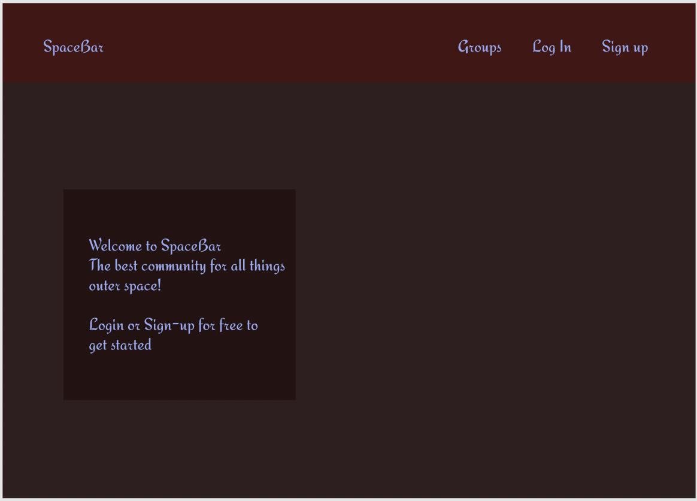
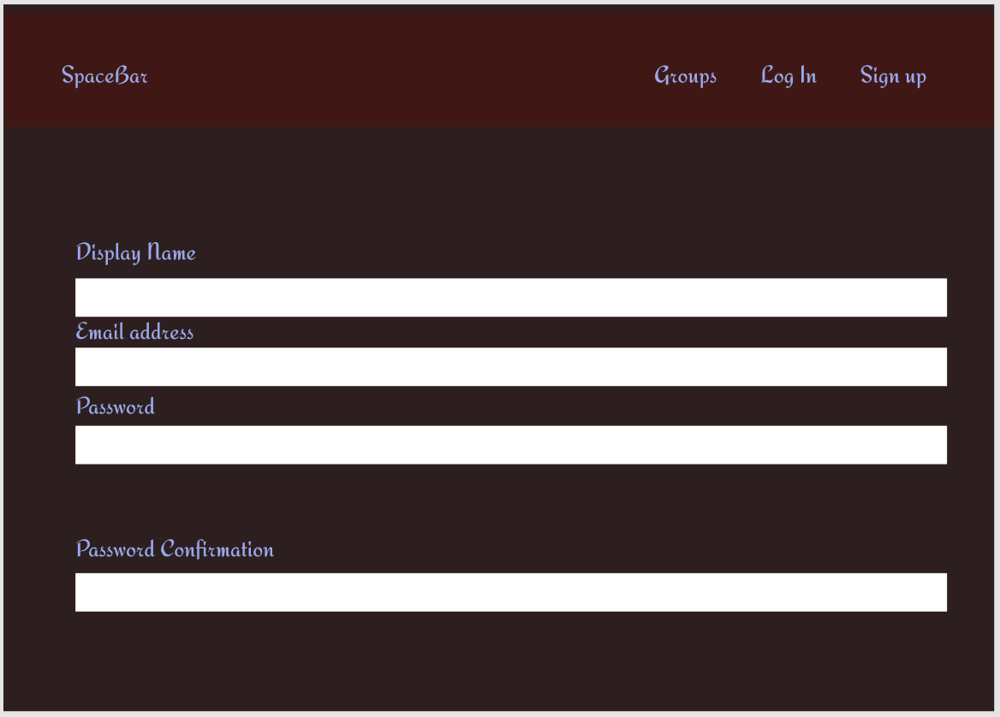
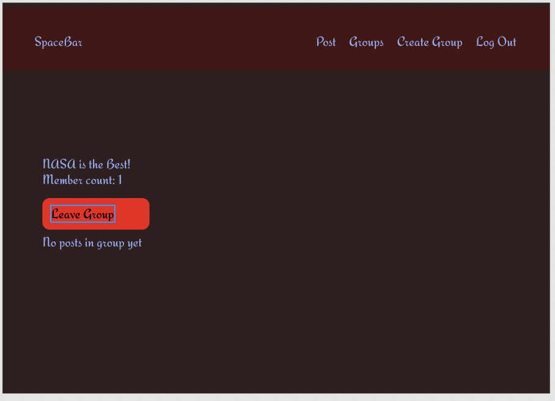
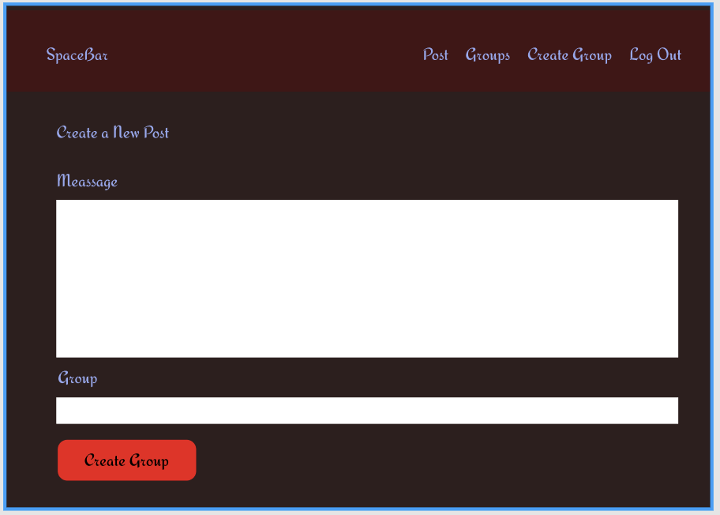

# Spacebar

## Technologies
 - HTML
 - CSS
 - JavaScript
 - Bootstrap
 - Python
 - Django
 - SQL

 ## The Plan
 This is going to be an outer space social community site:
 - users can create groups on various topics(SpaceX, NASA, Pluto, etc...)
 - The can then creat posts in the groups.
 - They can also leave and join other groups
 
 The key features will be:
    - Groups(similar to subreddits)
    - Multiple Users and Authorizations
    - Post in groups (similar to a tweet)
    - Linking user profiles with @ symbol
    

## Wireframes
### Landing Page

### Sign-Up Page

### Login Page

### just logged in

### My Groups Page

### Create a Group

### Group Page

### Create a post

### Post Made

