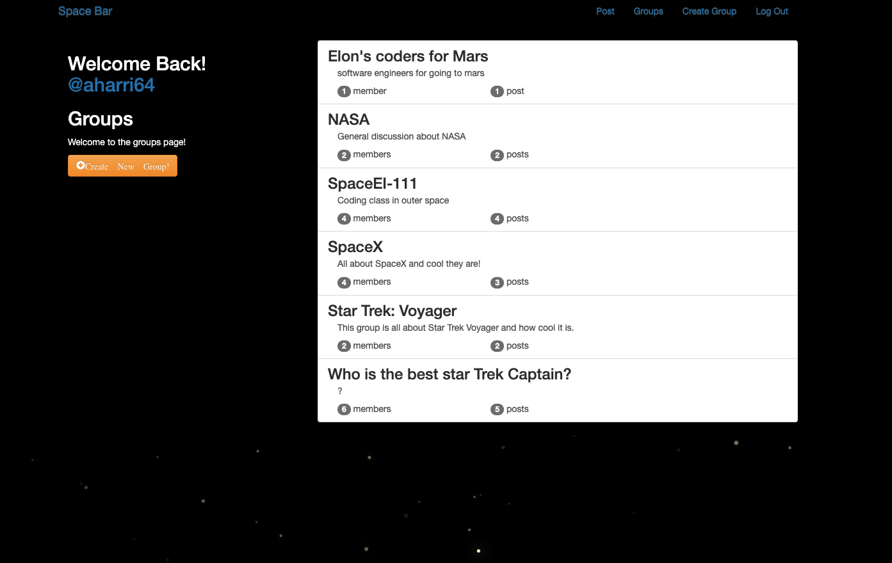
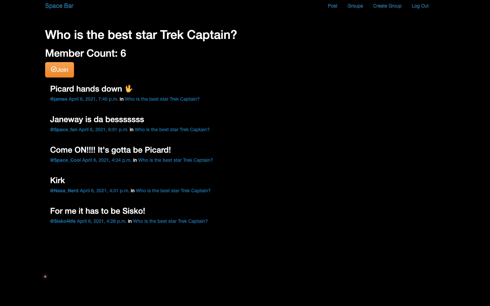

# SpaceBar


> A social app for Space and Sci-Fi lovers

---

### Table of Contents

- [Description](#description)
- [How To Use](#how-to-use)
- [References](#references)
- [License](#license)
- [Author Info](#author-info)

---

## Description

Space Bar is a space-centric forum style application where users can discuss and mingle with other space-minded users. Any user may create a group, join a group, and make a post on any group to which they are a part of. 

This application was created using django, python, and postgreSQL. It was build within a 7 day solo sprint while attending General Assembly. It utilizes several models in a one-to-many and many-to-many relationships as well as full django authentication.

I am a huge space enthusiast, I love learning and talking about anything space... Fact or Fiction. Please feel free to make an account, make or join a group, and debate who the best Star Trek Captain is.

#### Technologies

- Python
- Django

[Back To The Top](#read-me-template)

---

## How To Use

#### Installation


#### API Reference

```html
    <p>dummy code</p>
```
[Back To The Top](#read-me-template)

---

## References
[Back To The Top](#read-me-template)

---

## License

MIT License

Copyright (c) [2017] [James Q Quick]

Permission is hereby granted, free of charge, to any person obtaining a copy
of this software and associated documentation files (the "Software"), to deal
in the Software without restriction, including without limitation the rights
to use, copy, modify, merge, publish, distribute, sublicense, and/or sell
copies of the Software, and to permit persons to whom the Software is
furnished to do so, subject to the following conditions:

The above copyright notice and this permission notice shall be included in all
copies or substantial portions of the Software.

THE SOFTWARE IS PROVIDED "AS IS", WITHOUT WARRANTY OF ANY KIND, EXPRESS OR
IMPLIED, INCLUDING BUT NOT LIMITED TO THE WARRANTIES OF MERCHANTABILITY,
FITNESS FOR A PARTICULAR PURPOSE AND NONINFRINGEMENT. IN NO EVENT SHALL THE
AUTHORS OR COPYRIGHT HOLDERS BE LIABLE FOR ANY CLAIM, DAMAGES OR OTHER
LIABILITY, WHETHER IN AN ACTION OF CONTRACT, TORT OR OTHERWISE, ARISING FROM,
OUT OF OR IN CONNECTION WITH THE SOFTWARE OR THE USE OR OTHER DEALINGS IN THE
SOFTWARE.

[Back To The Top](#read-me-template)

---

## Author Info

- Twitter - [@jamesqquick](https://twitter.com/jamesqquick)
- Website - [James Q Quick](https://jamesqquick.com)

[Back To The Top](#read-me-template)


# SpaceBar
date: "2021-04-06T22:40:32.169Z"
image: './spacebar.png'
imageCredit: https://spacebarapp.herokuapp.com/
siteName: "Space Bar Live Site"
time: 
categories: ['Django', 'Python', 'JavaScript', 'PostgreSQL', 'CSS', 'HTML']

<a href="https://github.com/aharri64/Spacebar" target="_blank">Space Bar Repository</a>

<a href="https://spacebarapp.herokuapp.com/" target="_blank">Space Bar Deployed Site</a>


This application was created using django, python, and postgreSQL. It was build within a 7 day solo sprint while attending General Assembly. It utilizes several models in a one-to-many and many-to-many relationships as well as full django authentication.




